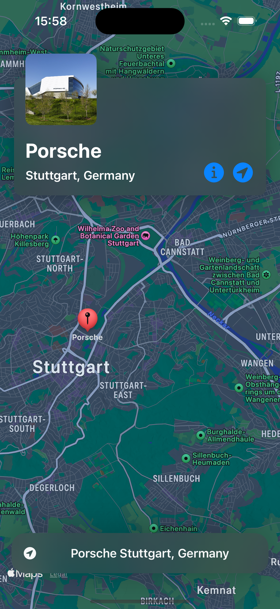

# map-locations-app
Maps App made using MapKit, and custom UI.

I've created a simple SwiftUI based iOS Application that uses the MVVM architecture, and displays the pinned locations on the Map. 

The Map is rendered on the screen using Apple's MapKit framework.

Each location has its own Info and Preview view.

When the info button is tapped, a full screen cover of the view is displayed on the main view.

If the user moves away from the loaded location, the user can redirect the map to the location by clicking on the redirect button.

The bottom bar houses the search bar, which at the moment contains only the pinned locations, tapping on any one of the locations changes the map's position of that location based on the coordinates of the tapped location.

Each location has its own custom pin that identifies the location from the others.